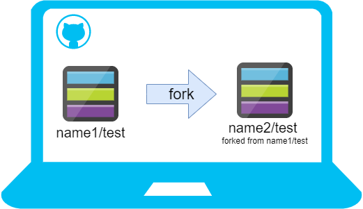
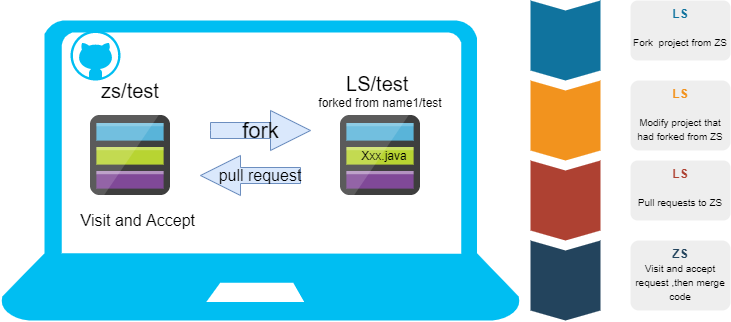

# 一、github

## 基本概念

### 1. 仓库（repository）

> 用来存储项目代码，一个项目对应一个仓库

### 2. 收藏（star）

> 收藏项目，用来再次查看

### 3.复制克隆项目（fork）

> 复制别人的项目到自己的GitHub上，并且是具有 **==独立性==** 的




### 4.发起请求（pull request）

>李四现在 fork 了张三一个项目, 然后李四在这个项目上做了修改添加了 Xxx.java 文件(原来张三的 test 仓库不会做出修改, 因为李四 fork 过来的test 仓库是 ==**独立存在**== 的!, 然后李四发送一个请求将在 test 仓库上做出的修改告诉张三, 然后张三查看了请求, 发现做出的修改还不错, 就将做出的修改代码合并到原 test 仓库



### 5. 关注（watch)

> 及时了解关注者的动态，掌握项目进展的情况

### 6. 事务（issue）

> 别人发现你的bug,提出一个issue，即问题，你们之间可以根据这些进行讨论，根据issue去解决bug

## ssh协议及创建

>SSH为Secure Shell(安全外壳协议),基于密钥的安全认证,是私钥和公钥进行配对.

>创建密钥对
>
>鼠标右击，click Git Bash Here,输入以下代码
>
>```jit
>ssh-keygen -t rsa
>```
>
>连续回车,在当前用户目录下存在密钥对
>
>私钥自己保存,公钥设置到GitHub上

