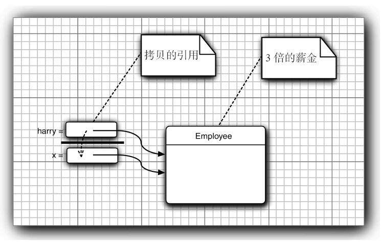

## java 的基本程序设计结构

```java
public class FirstSample{
    public static void main(String[] args){
        system.out.println("hello world")
    }
}
```

* java严格控制大小写

* 关键字public称为访问修饰符（access modifier），这些修饰符用于控制程序的其他部分对这段代码的访问级别。

* 标准的命名规范为（类名FirstSample就遵循了这个规范）：**==类名是以大写字母开头的名词。如果名字由多个单词组成，每个单词的第一个字母都应该大写==**（这种在一个单词中间使用大写字母的方式称为骆驼命名法。以其自身为例，应该写成CamelCase）

* 源代码的文件名必须与公共类的名字相同，并用.java作为扩展名

* ## 数据类型

* 长整型数值有一个后缀L或l（如4000000000L）

* float类型的数值有一个后缀F或f（例如，3.14F）。没有后缀F的浮点数值（如3.14）默认为double类型。当然，也可以在浮点数值后面添加后缀D或d（例如，3.14D）

* boolean（布尔）类型有两个值：false和true，用来判定逻辑条件。整型值和布尔值之间不能进行相互转换。

  ## 变量

* 在声明变量时，变量的类型位于变量名之前。

  ```java
  double salary;
  int vacationDays;
  long earthPopulation;
  ```

* 变量命名原则，需要时==**首个单词首字母小写，其余单词的首字母全部大写**==，并且每个变量的声明都要以；结尾

  ### 常量

  ```java
  常量关键字Final
  final double CM_PER_INCH = 2.54;
  ```

* 习惯上，常量名使用全大写。

* 在Java中，经常希望某个常量可以在一个类中的多个方法中使用，通常将这些常量称为类常量。可以使用==**关键字static final设置一个类常量**==。下面是使用类常量的示例：需要注意，类常量的定义位于main方法的外部。因此，在同一个类的其他方法中也可以使用这个常量。而且，**==如果一个常量被声明为public，那么其他类的方法也可以使用这个常量。==**

  ```java
  public class FirstSample{
      public static final double CM_PER_INCH = 2.54;
      
      public static void main(String[] args){
          system.out.println("hello world")
      }
  }
  ```

  ## 运算符

  ### 强制类型转换

* 强制类型转换的语法格式是在**==圆括号中给出想要转换的目标类型，后面紧跟待转换的变量名==**。例如

  ```java
  double x=9.97;
  int nx = (int)x;//变量nx的值为9 
  int nx =(int) Math.round(x);//得到最近的整数为10
  ```

  ### 枚举类型

  有时候，变量的取值只在一个有限的集合内。例如：销售的服装或比萨饼只有小、中、大和超大这四种尺寸。针对这种情况，可以自定义枚举类型。枚举类型包括有限个命名的值。例如

  ```java
  enum Size{SMALL,MEDIUM,LARGE,EXTRA_LARGE};
  Size s = Size.MEDIUM; 
  ```

* **==Size类型的变量只能存储这个类型声明中给定的某个枚举值，或者null值==**，null表示这个变量没有设置任何值。

  ## 字符串

  ### 字串

  String类的substring方法可以从一个较大的字符串提取出一个子串。例如：

  ```java
  String greeting = "hello";
  String s = greeting.substring(0,3);//"hel"
  ```

  **==substring方法的第二个参数是不想复制的第一个位置==**。这里要复制位置为0、1和2（从0到2，包括0和2）的字符。在substring中从0开始计数，直到3为止，但不包含3。

  ### 拼接

  Java语言允许使用+号连接（拼接）两个字符串。

  ```java
  String expletive = "Expletive";
  String PG13 = "deleted";
  String message  = expletive + PG13 //Expletivedeleted
  ```

  **==当将一个字符串与一个非字符串的值进行拼接时，后者被转换成字符串。==**例如：

  ```java
  int age = 13;
  String rating ="pg" + age;
  ```

  ### 检查字符串是否相等

  ```java
  s.equal(t)
  ```

  如果字符串s与字符串t相等，则返回true；否则，返回false。需要注意，**==s与t可以是字符串变量，也可以是字符串字面量。==**例如，下列表达式是合法的：

  ```java
  String greeting = "hello";
  "hello".equal(greeting)
  ```

  要想检测两个字符串是否相等，而不区分大小写，可以使用equalsIgnoreCase方法。

  ```java
  "Hello".equalIgnoreCase(greeting)	//可用于验证码验证
  ```

  > 一定不要使用==运算符检测两个字符串是否相等！

  ### 空串与null串 

  空串""是长度为0的字符串。可以调用以下代码检查一个字符串是否为空：

  ```java
  if(str.length()==0)
  if(str.equal(""))
  ```

  空串是一个字符串对象，有自己的串长度（0）和内容（空）。不过，String变量还可以存放一个特殊的值，名为null，这表示目前没有任何对象与该变量关联。要检查一个字符串是否为null，要使用以下条件：

  ```java
  if(str == null)
  ```

  时要检查一个字符串既不是null也不为空串，这种情况下就需要使用以下条件：

  ```java
  if(str != null && str.length() != 0)
  ```

  ## 输入输出

  读取“标准输入流”System.in就没有那么简单了。要想通过控制台进行输入，首先需要构造一个Scanner对象，并与“标准输入流”System.in关联。

  ```java
  Scanner in = new  Scanner(System.in);
  String name = in.nextLine();//nextLine方法将输入一行
  int age  =  in.nextInt();//要想读取一个整数，就调用nextInt方法。
  ```

* 方法名与[变量名](###变量)命名方式相同

  ### 格式化输出

  Java SE 5.0沿用了C语言库函数中的printf方法。

  ```java
  public class FormatTest1 {
  
      public static void main(String[] args) {
          int x = 5;
          double y = 3.141592;
  
          // 一般方式
          System.out.println("x = " + x + ", y = " + y);
          // printf()方式
          System.out.printf("x = %d, y = %f\n", x, y);
          // format()方式
          System.out.format("x = %d, y = %f\n", x, y);
      }
  }
  ```

  |                 用于printf flags(标志) 说明                  |
  | :----------------------------------------------------------: |
  |  |

  ## 文件输入与输出

  要想对文件进行读取，就需要一个用File对象构造一个Scanner对象，如下所示：

  ```java
  Scanner in = new Scanner(Path.get("myfile.txt")); //读取文件
  String s = in.nextLine();
  ```

  > 如果文件名中包含反斜杠符号，就要记住在每个反斜杠之前再加一个额外的反斜杠：“c：\\mydirectory\\myfile.txt”。

  要想写入文件，就需要构造一个PrintWriter对象。在构造器中，只需要提供文件名：

  ```java
  PrintWriter  out = new PrintWriter(“myfile.txt”,“utf-8”);
  ```

  >要记住一点：如果用一个不存在的文件构造一个Scanner，或者用一个不能被创建的文件名构造一个PrintWriter，那么就会发生异常。Java编译器认为这些异常比“被零除”异常更严重

  ## 控制流程

  ### 块语句

  块（即复合语句）是指由一对大括号括起来的若干条简单的Java语句。块确定了变量的作用域。一个块可以嵌套在另一个块中。下面就是在main方法块中嵌套另一个语句块的示例。

  ```java
   public static void main(String[] args) {
       int n;
       {
           int k;
       }
   }//但是，不能在嵌套的两个块中声明同名的变量。
  ```

  ### 中断控制流程语句

  Java还提供了一种**==带标签的break语句==**，用于跳出多重嵌套的循环语句。有时候，在嵌套很深的循环语句中会发生一些不可预料的事情。此时可能更加希望跳到嵌套的所有循环语句之外。这里有一个示例说明了break语句的工作状态。请注意，**==标签必须放在希望跳出的最外层循环之前，并且必须紧跟一个冒号==**。

  ```java
  read_data://标签
  while(){
      for(){
          break read_data;
      }
          
  }
  ```

  ## 数组

  在声明数组变量时，需要指出数组类型（数据元素类型紧跟[]）和数组变量的名字。

  ```java
  int[]a = new int[100];//创建了一个可以存储100个整数的数组
  ```

  数组的下标从0~99,不是100,数组元素赋值。例如，使用一个循环：

  ```java
  int[]a = new int[100];
  for(int i = 0,i <100,i++){
      a[i]=i;
  }
  ```

  创建一个数字数组时，所有元素都初始化为0。boolean数组的元素会初始化为false。对象数组的元素则初始化为一个特殊值null，这表示这些元素（还）未存放任何对象。

  ### for each循环

  增强的for循环的语句格式为：

  ```java
  for(variable : collection) statement
  ```

  定义一个变量用于暂存集合中的每一个元素，并执行相应的语句（当然，也可以是语句块）。collection这一集合表达式必须是一个数组或者是一个实现了Iterable接口的类对象（例如ArrayList）

  ```java
  for (int element : a)//a is set
      System.out.println(element);
  ```

  ### 数组初始化以及匿名数组

  在Java中，提供了一种创建数组对象并同时赋予初始值的简化书写形式

  ```java
  int[] smallPrimes =  {2,3,5,7,11};//请注意，在使用这种语句时，不需要调用new。
  ```

  创建一个新数组并利用括号中提供的值进行初始化，数组的大小就是初始值的个数。使用下面这种语法形式可以在不创建新变量的情况下重新初始化一个数组。例如：

  ```java
  smallPrimes = new int[]{17,19,23,29,31}
  ```

  ## 对象与对象变量

  **==构造器的名字应该与类名相同==**。因此Date类的构造器名为Date。要想构造一个Date对象，需要在构造器前面加上new操作符，如下所示：

  ```java
  Date birthday = new Date(); //创建对象
  ```

  也可以将一个方法应用于刚刚创建的对象。Date类中有一个toString方法。这个方法将返回日期的字符串描述。下面的语句可以说明如何将toString方法应用于新构造的Date对象上。

  ```java
  String s = new Date().toString();
  ```

  **==在对象与对象变量之间存在着一个重要的区别==**。例如，语句

  ```java
  Date deadline; //deadline doesn't refer to any object
  ```

  定义了一个对象变量deadline，它可以引用Date类型的对象。但是，一定要认识到：变量deadline不是一个对象，实际上也没有引用对象。此时，不能将任何Date方法应用于这个变量上。语句

  ```java
  s = deadline.toString();
  ```

  将产生编译错误。

  > 一定要认识到：一个对象变量并没有实际包含一个对象，而仅仅引用一个对象。

  类库设计者决定将保存时间与给时间点命名分开。所以标准Java类库分别包含了两个类：一个是用来表示时间点的Date类；另一个是用来表示大家熟悉的日历表示法的LocalDate类。

  **不要使用构造器来构造LocalDate类的对象。实际上，应当使用静态工厂方法（factory method）代表你调用构造器**。下面的表达式

  ```java
  LocalDate.now()
  ```

  会构造一个新对象，表示构造这个对象时的日期。

  可以提供年、月和日来构造对应一个特定日期的对象：

  ```java
  LocalDate newYearEve = LocalDate.of(1999,12,31);
  ```

  ## 用户自定义类

  现在开始学习如何设计复杂应用程序所需要的各种主力类（workhorse class）。==**通常，这些类没有main方法，却有自己的实例域和实例方法。要想创建一个完整的程序，应该将若干类组合在一起，其中只有一个类有main方法。**==

  源文件名是EmployeeTest.java，这是因为**==文件名必须与public类的名字相匹配。在一个源文件中，只能有一个公有类，但可以有任意数目的非公有类。==**

  一个源文件包含了两个类。许多程序员习惯于将每一个类存在一个单独的源文件中。例如，将Employee类存放在文件Employee.java中，将EmployeeTest类存放在文件EmployeeTest.java中。

  ## 从构造器开始

  下面先看看Employee类的构造器：

  ```java
  public employee(String n,double s,int year,int month,int day){
      name = n;
      salary = s;
      LocalDate hireDay = LocalDate.of(year,month,day);
  }
  public void raiseSalary(double byPersent){
      double raise = salary * byPersent/100;
      salary += raise;
  }
  ```

  使用下面这条代码创建Employee类实例时：

  ```java
  new employee("Jame",10000,1950,9,1)
  ```

  > 构造器与其他的方法有一个重要的不同。构造器总是伴随着new操作符的执行被调用，而不能对一个已经存在的对象调用构造器来达到重新设置实例域的目的。

  * 构造器与类同名
  * 每个类可以有一个以上的构造器
  * 构造器可以有0个、1个或多个参数
  * 构造器没有返回值
  * 构造器总是伴随着new操作一起调用

  > 请注意，不要在构造器/方法中定义与实例域重名的局部变量。例如，下面的构造器将无法设置salary。

  方法用于操作对象以及存取它们的实例域

  ## 隐式参数与显式参数

  第一个参数称为隐式（implicit）参数，是出现在方法名前的Employee类对象。第二个参数位于方法名后面括号中的数值，这是一个显式（explicit）参数。（有些人把隐式参数称为方法调用的目标或接收者。）

  在每一个方法中，关键字this表示隐式参数。如果需要的话，可以用下列方式编写raiseSalary方法：

  ```java
  public void raiseSalary(double byPersent){
      double raise = this.salary * byPersent/100;//实例域：this.salary	局部变量：raise
      this.salary += raise;
  }
  ```

  有些程序员更偏爱这样的风格，因为这样可以将实例域与局部变量明显地区分开来。

  注意不要编写返回引用可变对象的访问器方法。在Employee类中就违反了这个设计原则，其中的getHireDay方法返回了一个Date类对象:

  ```java
  class employee{
      private Date hireDay;
      ...
      public Date getHireDay(){
          return hireDay//bad
      }
  }
  ```

  ## 基于类的访问权限

  一个方法可以访问所属类的所有对象的私有数据

  ## 静态域

  如果将域定义为static，每个类中只有一个这样的域。而每一个对象对于所有的实例域却都有自己的一份拷贝。例如，假定需要给每一个雇员赋予唯一的标识码。这里给Employee类添加一个实例域id和一个静态域nextId：

  ```java
  class employee{
      private static int nextId = 1;
      private int id;
      ...
  }
  harry.id = employee.nextID
  ```

  现在，每**==一个雇员对象都有一个自己的id域，但这个类的所有实例将共享一个nextId域==**。换句话说，如果有1000个Employee类的对象，则有1000个实例域id。但是，只有一个静态域nextId。**==即使没有一个雇员对象，静态域nextId也存在。它属于类，而不属于任何独立的对象。==**即需要使用类名来调用静态域

  ## 静态常量

  [静态常量](###常量)

  在Math类中定义了一个静态常量：

  ```java
  public class Math{
      ...
      public static final double PI = 3.1415926535897
  }
  ```

  在程序中，可以采用Math.PI的形式获得这个常量。同样使用类名来调用静态常量

  如果关键字static被省略，PI就变成了Math类的一个实例域。需要通过Math类的对象访问PI，并且每一个Math对象都有它自己的一份PI拷贝。

  ## 静态方法

  静态方法是一种不能向对象实施操作的方法。例如，Math类的pow方法就是一个静态方法。表达式

  ```java
  Math.pow(x,a)
  ```

  Employee类的静态方法不能访问Id实例域，因为它不能操作对象。但是，静态方法可以访问自身类中的静态域。下面是使用这种静态方法的一个示例：

  ```java
  public static int getNextId(){
      return nextId;
  }
  ```

  可以通过类名调用这个方法：

  ```java
  int n = Employee.getNextId();
  ```

  这个方法可以省略关键字static吗？答案是肯定的。但是，需要通过Employee类对象的引用调用这个方法。

  > 在下面两种情况下使用静态方法：
  >
  > * 一个方法不需要访问对象状态，其所需参数都是通过显式参数提供（例如：Math.pow）。
  > * 一个方法只需要访问类的静态域（例如：Employee.getNextId）。

  ## 方法参数

  **==Java程序设计语言总是采用按值调用。也就是说，方法得到的是所有参数值的一个拷贝，特别是，方法不能修改传递给它的任何参数变量的内容。==**

  一个方法不可能修改一个基本数据类型的参数。而对象引用作为参数就不同了，可以很容易地利用下面这个方法实现将一个雇员的薪金提高两倍的操作:

  ```java
  public static void tripleSalary(Employee x){
      x.raiseSalary(200)
  }
  ```

  当调用

  ```java
  harry = new Employee(...);
  tripleSalary(harry);
  ```

  具体的执行过程为：

  1）x被初始化为harry值的拷贝，这里是一个对象的引用。

  2）raiseSalary方法应用于这个对象引用。x和harry同时引用的那个Employee对象的薪金提高了200%。

  3）方法结束后，参数变量x不再使用。当然，对象变量harry继续引用那个薪金增至3倍的雇员对象（如图4-7所示）。

  

  

  > 有些程序员（甚至本书的作者）认为Java程序设计语言对对象采用的是引用调用，实际上，这种理解是不对的。Java程序设计语言对对象采用的不是引用调用，实际上，对象引用是按值传递的

  ## 重载

  如果多个方法（比如，StringBuilder构造器方法）**==有相同的名字、不同的参数==**，便产生了重载。编译器必须挑选出具体执行哪个方法，它通**==过用各个方法给出的参数类型与特定方法调用所使用的值类型进行匹配==**来挑选出相应的方法。如果编译器找不到匹配的参数，就会产生编译时错误，因为根本不存在匹配，或者没有一个比其他的更好。（这个过程被称为重载解析（overloading resolution）。

  如果在构造器中没有显式地给域赋予初值，那么就会被自**动地赋为默认值：数值为0、布尔值为false、对象引用为null**。然而，只有缺少程序设计经验的人才会这样做。确实，如果不明确地对域进行初始化，就会影响程序代码的可读性。

  ## 无参数的构造器

  如果在编写一个类时没有编写构造器，那么系统就会提供一个无参数构造器。这个构造器将所有的实例域设置为默认值。于是，实例域中的数值型数据设置为0、布尔型数据设置为false、所有对象变量将设置为null。

  ## 参数名

  有些程序员在每个方法内的参数前面加上一个前缀“a”

  ```java
  public Employee(String aName,double aSalary){
      name = aName;
      salary = aSalary;
  }
  ```

  还一种常用的技巧，它基于这样的事实：参数变量用同样的名字将实例域屏蔽起来。例如，如果将参数命名为salary，salary将引用这个参数，而不是实例域。但是，可以采用this.salary的形式访问实例域。回想一下，this指示隐式参数，也就是所构造的对象。this 是一个对象引用。下面是一个示例：

  ```java
  public Employee(String name, double Salary){
      this.name = name;
      this.salary = salary;
  } 
  ```

  ## 调用另一个构造器

  如果构造器的第一个语句形如**==this（...），这个构造器将调用同一个类的另一个构造器==**。下面是一个典型的例子：

  ```java
  public Employee(double s){
      this("Employee #" + nextId,s);
      nextId++;
  }
  ```

  当调用new Employee（60000）时，Employee（double）构造器将调用Employee（String，double）构造器。

  采用这种方式使用this关键字非常有用，这样对公共的构造器代码部分只编写一次即可。

  ## 初始化块

  初始化块是初始化数据域的一种方法，具体的实现

  ```java
  {
      id = nextId;
      nextId++;
  }
  ```

  下面是调用构造器的具体处理步骤：

  1）所有数据域被初始化为默认值（0、false或null）。

  2）按照在类声明中出现的次序，依次执行所有域初始化语句和初始化块。

  3）如果构造器第一行调用了第二个构造器，则执行第二个构造器主体。

  4）执行这个构造器的主体。

  ## 类路径

  没懂😫

  ## 注释的插入

  每个/******...*/文档注释在标记之后紧跟着自由格式文本free-form text）。标记由@开始，如@author或@param。

  自由格式文本的第一句应该是一个概要性的句子。javadoc实用程序自动地将这些句子抽取出来形成概要页。

  在自由格式文本中，可以使用HTML修饰符，例如，用于强调的<em>...</em>、用于着重强调的<strong>...</strong>以及包含图像的等。不过，一定不要使用<h1>或<hr>，因为它们会与文,档的格式产生冲突。若要键入等宽代码，需使用{@code...}而不是<code>...</code>——这样一来，就不用操心对代码中的字符转义了。

  如果文档中有到其他文件的链接，例如，图像文件（用户界面的组件的图表或图像等），就应该将这些文件放到子目录doc-files中。javadoc实用程序将从源目录拷贝这些目录及其中的文件到文档目录中。在链接中需要使用doc-files目录，例如：。

  ## 方法注释

  **==每一个方法注释必须放在所描述的方法之前==**。除了通用标记之外，还可以使用下面的标记：

  ### @param变量描述

  这个标记将对当前方法的“param”（参数）部分添加一个条目。这个描述可以占据多行，并可以使用HTML标记。一个方法的所有@param标记必须放在一起。

  ### ·@return描述

  这个标记将对当前方法添加“return”（返回）部分。这个描述可以跨越多行，并可以使用HTML标记。

  ### ·@throws类描述

  这个标记将添加一个注释，用于表示这个方法有可能抛出异常。有关异常的详细内容将在第10章中讨论。

  ```java
  /**
  *Raise the salary of an employee
  *@param byPercent the percent by which to raise the salary (e.g. 10 means 10%)
  *@return the amount of the raise
  */
  public double raiseSalary(double byPercent){
      double raise = salary * byPercent / 100;
      salary += raise;
      return raise;
  }
  ```

  ## 通用注释

  下面的标记可以用在类文档的注释中。

  ·@author姓名

  这个标记将产生一个“author”（作者）条目。可以使用多个@author标记，每个@author标记对应一个作者。

  ·@version文本

  这个标记将产生一个“version”（版本）条目。这里的文本可以是对当前版本的任何描述。

  ## 类设计技巧

  1.一定要保证数据私有

  这是最重要的；绝对不要破坏封装性。有时候，需要编写一个访问器方法或更改器方法，但是最好还是保持实例域的私有性。

  2.一定要对数据初始化

  Java不对局部变量进行初始化，但是会对对象的实例域进行初始化。最好不要依赖于系统的默认值，而是应该显式地初始化所有的数据，具体的初始化方式可以是提供默认值，也可以是在所有构造器中设置默认值。

  3.不要在类中使用过多的基本类型

  就是说，用其他的类代替多个相关的基本类型的使用。这样会使类更加易于理解且易于修改。例如，用一个称为Address的新的类替换一个Customer类中以下的实例域：

  ```java
  private String street;
  private String city;
  private String state;
  ```

  

  4.不是所有的域都需要独立的域访问器和域更改器

  或许，需要获得或设置雇员的薪金。而一旦构造了雇员对象，就应该禁止更改雇用日期，并且在对象中，常常包含一些不希望别人获得或设置的实例域，例如，在Address类中，存放州缩写的数组。

  5.将职责过多的类进行分解

  这样说似乎有点含糊不清，究竟多少算是“过多”？每个人的看法不同。但是，如果明显地可以将一个复杂的类分解成两个更为简单的类，就应该将其分解

  6.类名和方法名要能够体现它们的职责

  与变量应该有一个能够反映其含义的名字一样，类也应该如此	

  命名类名的良好习惯是采用一个名词（Order）、前面有形容词修饰的名词（RushOrder）或动名词（有“-ing”后缀）修饰名词（例如，BillingAddress）。对于方法来说，习惯是访问器方法用小写get开头（getSalary），更改器方法用小写的set开头（setSalary）。

  7.优先使用不可变的类

  LocalDate类以及java.time包中的其他类是不可变的——没有方法能修改对象的状态。

  ## 覆盖方法（override）

  覆盖方法，也称对方法的重写。

  ```java
  public double getSalary(){
      return salary + bouns;	//doesn't work
  }
  ```

  这个方法并不能运行。这是因==为**Manager类的getSalary方法不能够直接地访问超类的私有域**==。也就是说，尽管每个Manager对象都拥有一个名为salary的域，但在Manager类的getSalary方法中并不能够直接地访问salary域。**==只有Employee类的方法才能够访问私有部分==**。如果Manager类的方法一定要访问私有域，就必须借助于公有的接口==，Employee类中的公有方法getSalary正是这样一个接口==。

  ```java
  public double getSalary(){
      double baseSalary = getSalary();
      return baseSalary + bouns;	// still doesn't work
  }
  ```

  上面这段代码仍然不能运行。问题出现在调用getSalary的语句上，这是因为Manager类也有一个getSalary方法（就是正在实现的这个方法），所以这条语句将会导致无限次地调用自己，直到整个程序崩溃为止。

  这里需要指出：我们希望调用超类Employee中的getSalary方法，而不是当前类的这个方法。为此，可以使用特定的关键字super解决这个问题：

  ```java
  super.getSalary()
  ```

  ```java
  public double getSalary(){
      double baseSalary = super.getSalary();
      return baseSalary + bouns;	//  work
  }
  ```

  >有些人认为super与this引用是类似的概念，实际上，这样比较并不太恰当。这是因为super不是一个对象的引用，不能将super赋给另一个对象变量，它只是一个指示编译器调用超类方法的特殊关键字。

  