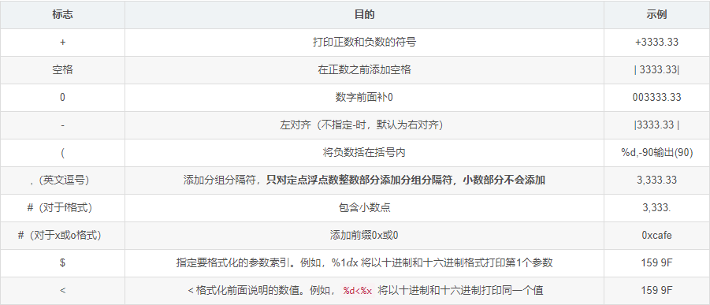

## java 的基本程序设计结构

```java
public class FirstSample{
    public static void main(String[] args){
        system.out.println("hello world")
    }
}
```

* java严格控制大小写

* 关键字public称为访问修饰符（access modifier），这些修饰符用于控制程序的其他部分对这段代码的访问级别。

* 标准的命名规范为（类名FirstSample就遵循了这个规范）：**==类名是以大写字母开头的名词。如果名字由多个单词组成，每个单词的第一个字母都应该大写==**（这种在一个单词中间使用大写字母的方式称为骆驼命名法。以其自身为例，应该写成CamelCase）

* 源代码的文件名必须与公共类的名字相同，并用.java作为扩展名

  ## 数据类型

* 长整型数值有一个后缀L或l（如4000000000L）

* float类型的数值有一个后缀F或f（例如，3.14F）。没有后缀F的浮点数值（如3.14）默认为double类型。当然，也可以在浮点数值后面添加后缀D或d（例如，3.14D）

* boolean（布尔）类型有两个值：false和true，用来判定逻辑条件。整型值和布尔值之间不能进行相互转换。

  ## 变量

* 在声明变量时，变量的类型位于变量名之前。

  ```java
  double salary;
  int vacationDays;
  long earthPopulation;
  ```

* 变量命名原则，需要时==**首个单词首字母小写，其余单词的首字母全部大写**==，并且每个变量的声明都要以；结尾

  ### 常量

  ```java
  常量关键字Final
  final double CM_PER_INCH = 2.54;
  ```

* 习惯上，常量名使用全大写。

* 在Java中，经常希望某个常量可以在一个类中的多个方法中使用，通常将这些常量称为类常量。可以使用==**关键字static final设置一个类常量**==。下面是使用类常量的示例：需要注意，类常量的定义位于main方法的外部。因此，在同一个类的其他方法中也可以使用这个常量。而且，**==如果一个常量被声明为public，那么其他类的方法也可以使用这个常量。==**

  ```java
  public class FirstSample{
      public static final double CM_PER_INCH = 2.54;
      
      public static void main(String[] args){
          system.out.println("hello world")
      }
  }
  ```

  ## 运算符

  ### 强制类型转换

* 强制类型转换的语法格式是在**==圆括号中给出想要转换的目标类型，后面紧跟待转换的变量名==**。例如

  ```java
  double x=9.97;
  int nx = (int)x;//变量nx的值为9 
  int nx =(int) Math.round(x);//得到最近的整数为10
  ```

  ### 枚举类型

  有时候，变量的取值只在一个有限的集合内。例如：销售的服装或比萨饼只有小、中、大和超大这四种尺寸。针对这种情况，可以自定义枚举类型。枚举类型包括有限个命名的值。例如

  ```java
  enum Size{SMALL,MEDIUM,LARGE,EXTRA_LARGE};
  Size s = Size.MEDIUM; 
  ```

* **==Size类型的变量只能存储这个类型声明中给定的某个枚举值，或者null值==**，null表示这个变量没有设置任何值。

  ## 字符串

  ### 字串

  String类的substring方法可以从一个较大的字符串提取出一个子串。例如：

  ```java
  String greeting = "hello";
  String s = greeting.substring(0,3);//"hel"
  ```

  **==substring方法的第二个参数是不想复制的第一个位置==**。这里要复制位置为0、1和2（从0到2，包括0和2）的字符。在substring中从0开始计数，直到3为止，但不包含3。

  ### 拼接

  Java语言允许使用+号连接（拼接）两个字符串。

  ```java
  String expletive = "Expletive";
  String PG13 = "deleted";
  String message  = expletive + PG13 //Expletivedeleted
  ```

  **==当将一个字符串与一个非字符串的值进行拼接时，后者被转换成字符串。==**例如：

  ```java
  int age = 13;
  String rating ="pg" + age;
  ```

  ### 检查字符串是否相等

  ```java
  s.equal(t)
  ```

  如果字符串s与字符串t相等，则返回true；否则，返回false。需要注意，**==s与t可以是字符串变量，也可以是字符串字面量。==**例如，下列表达式是合法的：

  ```java
  String greeting = "hello";
  "hello".equal(greeting)
  ```

  要想检测两个字符串是否相等，而不区分大小写，可以使用equalsIgnoreCase方法。

  ```java
  "Hello".equalIgnoreCase(greeting)	//可用于验证码验证
  ```

  > 一定不要使用==运算符检测两个字符串是否相等！

  ### 空串与null串

  空串""是长度为0的字符串。可以调用以下代码检查一个字符串是否为空：

  ```java
  if(str.length()==0)
  if(str.equal(""))
  ```

  空串是一个字符串对象，有自己的串长度（0）和内容（空）。不过，String变量还可以存放一个特殊的值，名为null，这表示目前没有任何对象与该变量关联。要检查一个字符串是否为null，要使用以下条件：

  ```java
  if(str == null)
  ```

  时要检查一个字符串既不是null也不为空串，这种情况下就需要使用以下条件：

  ```java
  if(str != null && str.length() != 0)
  ```

  ## 输入输出

  读取“标准输入流”System.in就没有那么简单了。要想通过控制台进行输入，首先需要构造一个Scanner对象，并与“标准输入流”System.in关联。

  ```java
  Scanner in = new  Scanner(System.in);
  String name = in.nextLine();//nextLine方法将输入一行
  int age  =  in.nextInt();//要想读取一个整数，就调用nextInt方法。
  ```

* 方法名与[变量名](###变量)命名方式相同

  ### 格式化输出

  Java SE 5.0沿用了C语言库函数中的printf方法。

  ```java
  public class FormatTest1 {
  
      public static void main(String[] args) {
          int x = 5;
          double y = 3.141592;
  
          // 一般方式
          System.out.println("x = " + x + ", y = " + y);
          // printf()方式
          System.out.printf("x = %d, y = %f\n", x, y);
          // format()方式
          System.out.format("x = %d, y = %f\n", x, y);
      }
  }
  ```

  |                 用于printf flags(标志) 说明                  |
  | :----------------------------------------------------------: |
  |  |

  ## 文件输入与输出

  要想对文件进行读取，就需要一个用File对象构造一个Scanner对象，如下所示：

  ```java
  Scanner in = new Scanner(Path.get("myfile.txt")); //读取文件
  String s = in.nextLine();
  ```

  > 如果文件名中包含反斜杠符号，就要记住在每个反斜杠之前再加一个额外的反斜杠：“c：\\mydirectory\\myfile.txt”。

  要想写入文件，就需要构造一个PrintWriter对象。在构造器中，只需要提供文件名：

  ```java
  PrintWriter  out = new PrintWriter(“myfile.txt”,“utf-8”);
  ```

  >要记住一点：如果用一个不存在的文件构造一个Scanner，或者用一个不能被创建的文件名构造一个PrintWriter，那么就会发生异常。Java编译器认为这些异常比“被零除”异常更严重

  ## 控制流程

  ### 块语句

  块（即复合语句）是指由一对大括号括起来的若干条简单的Java语句。块确定了变量的作用域。一个块可以嵌套在另一个块中。下面就是在main方法块中嵌套另一个语句块的示例。

  ```java
   public static void main(String[] args) {
       int n;
       {
           int k;
       }
   }//但是，不能在嵌套的两个块中声明同名的变量。
  ```

  ### 中断控制流程语句

  Java还提供了一种**==带标签的break语句==**，用于跳出多重嵌套的循环语句。有时候，在嵌套很深的循环语句中会发生一些不可预料的事情。此时可能更加希望跳到嵌套的所有循环语句之外。这里有一个示例说明了break语句的工作状态。请注意，**==标签必须放在希望跳出的最外层循环之前，并且必须紧跟一个冒号==**。

  ```java
  read_data://标签
  while(){
      for(){
          break read_data;
      }
          
  }
  ```

  ## 数组

  在声明数组变量时，需要指出数组类型（数据元素类型紧跟[]）和数组变量的名字。

  ```java
  int[]a = new int[100];//创建了一个可以存储100个整数的数组
  ```

  数组的下标从0~99,不是100,数组元素赋值。例如，使用一个循环：

  ```java
  int[]a = new int[100];
  for(int i = 0,i <100,i++){
      a[i]=i;
  }
  ```

  创建一个数字数组时，所有元素都初始化为0。boolean数组的元素会初始化为false。对象数组的元素则初始化为一个特殊值null，这表示这些元素（还）未存放任何对象。

  ### for each循环

  增强的for循环的语句格式为：

  ```java
  for(variable : collection) statement
  ```

  定义一个变量用于暂存集合中的每一个元素，并执行相应的语句（当然，也可以是语句块）。collection这一集合表达式必须是一个数组或者是一个实现了Iterable接口的类对象（例如ArrayList）

  ```java
  for (int element : a)//a is set
      System.out.println(element);
  ```

  ### 数组初始化以及匿名数组

  在Java中，提供了一种创建数组对象并同时赋予初始值的简化书写形式

  ```java
  int[] smallPrimes =  {2,3,5,7,11};//请注意，在使用这种语句时，不需要调用new。
  ```

  创建一个新数组并利用括号中提供的值进行初始化，数组的大小就是初始值的个数。使用这种语法形式可以在不创建新变量的情况下重新初始化一个数组。例如：

  ```java
  smallPrimes = new int[]{17,19,23,29,31}
  ```

  